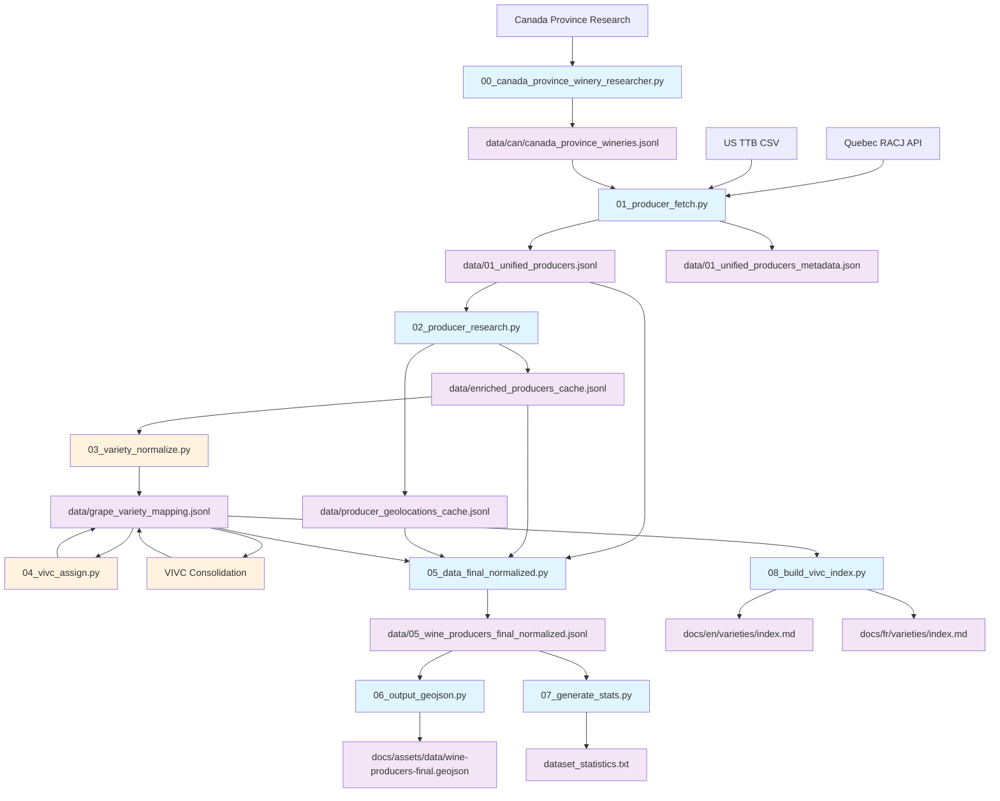

# 🍇 Grape Research Pipeline

> Comprehensive pipeline for discovering, researching, and normalizing North American wine producer data with grape variety classification.

## 🔧 Environment Setup

See `.env.example` for required environment variables.

```bash
# Install dependencies
uv sync
```

## 📊 Pipeline Overview



## 🚀 Command Reference

### New Region Research (Full Pipeline)
```bash
# 0. Research Canadian provinces (current: NB, NL, NS, PE)
uv run src/00_canada_province_winery_researcher.py --province "NB,NL,NS,PE" --previous-list data/can/canada_province_wineries.jsonl --yes --threads 4

# 1. Unify all data sources  
uv run src/01_producer_fetch.py

# 2. Research & enrich producers
uv run src/02_producer_research.py --yes

# 3. Normalize varieties (MANUAL REVIEW NEEDED)
uv run src/03_variety_normalize.py --limit 20

# 4. Assign VIVC data
uv run src/04_vivc_assign.py --limit 10

# 5. Consolidate VIVC duplicates (CRITICAL)
uv run src/includes/grape_varieties.py consolidate

# 6. Generate final dataset
uv run src/05_data_final_normalized.py

# 7. Generate outputs
uv run src/06_output_geojson.py
uv run src/07_generate_stats.py
uv run src/08_build_vivc_index.py  
```

### Variety Updates Only
```bash
# When new varieties found - steps 3-6 only
uv run src/03_variety_normalize.py --limit 20  # Manual review needed
uv run src/04_vivc_assign.py
uv run src/includes/grape_varieties.py consolidate  # CRITICAL
uv run src/05_data_final_normalized.py
```

### Testing Commands
```bash
# Test producer research
uv run src/02_producer_research.py --limit 10

# Test variety processing
uv run src/03_variety_normalize.py --dry-run
uv run src/04_vivc_assign.py --limit 5

# Generate stats with varieties
uv run src/07_generate_stats.py --varieties
```

## 📁 Key Data Files

| File | Purpose | Updated By |
|------|---------|------------|
| `data/01_unified_producers.jsonl` | Unified producer records | `01_producer_fetch.py` |
| `data/enriched_producers_cache.jsonl` | Enriched wine producer data | `02_producer_research.py` |
| `data/grape_variety_mapping.jsonl` | **Central variety database** | `03_variety_normalize.py`, `04_vivc_assign.py` |
| `data/05_wine_producers_final_normalized.jsonl` | **Final production dataset** | `05_data_final_normalized.py` |

## ⚠️ Important Notes

### Manual Review Required
- **Step 3** (`03_variety_normalize.py`) output needs manual review as AI classification can be imprecise

### Critical Dependencies
- **VIVC Consolidation** MUST run after any VIVC assignments to merge duplicates
- **Final dataset** is the single source of truth for all outputs

### Pipeline Triggers
1. **New region indexing** → Full pipeline (steps 0-8)
2. **Re-running existing sources** → May find new producers/varieties
3. **New variety discoveries** → Variety processing steps (3-6)

---

*For detailed script documentation, see individual script file headers.*